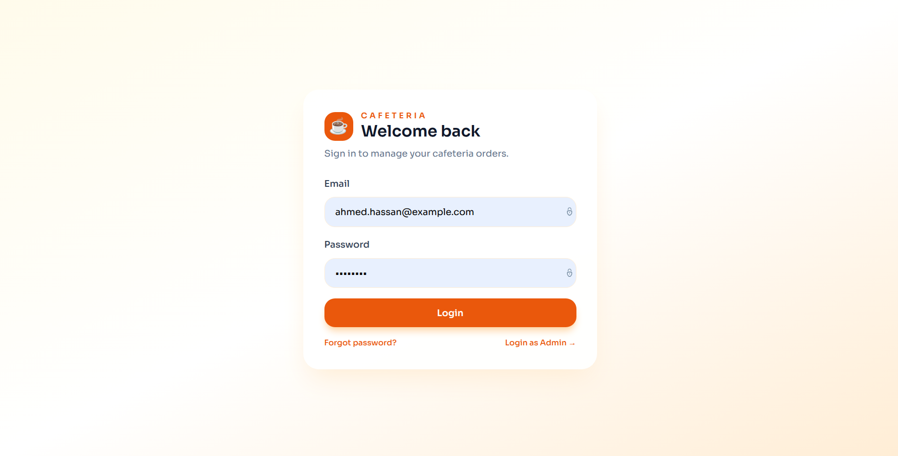
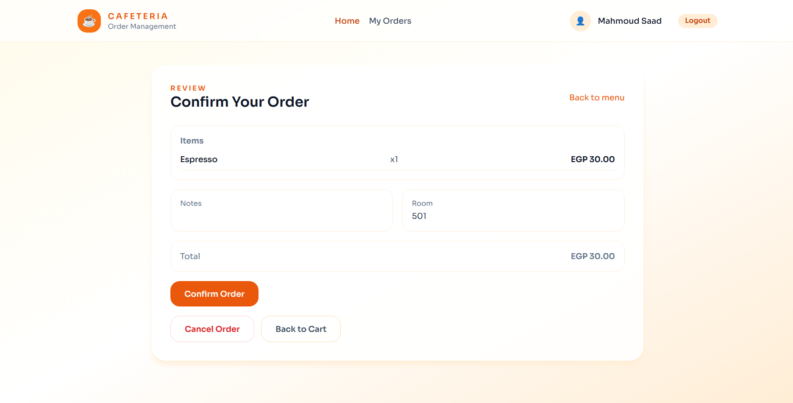
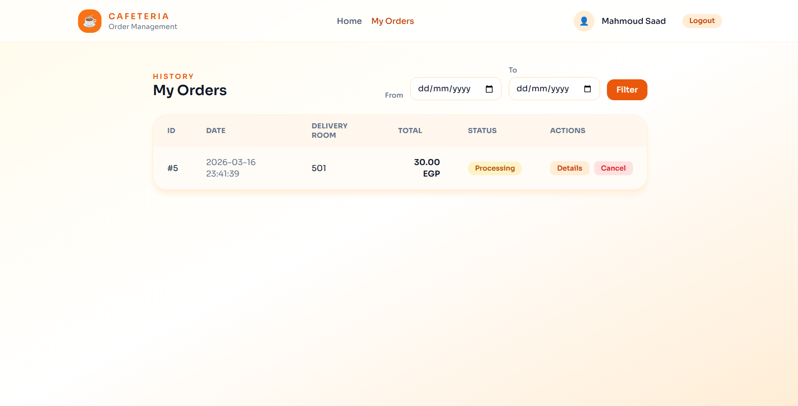
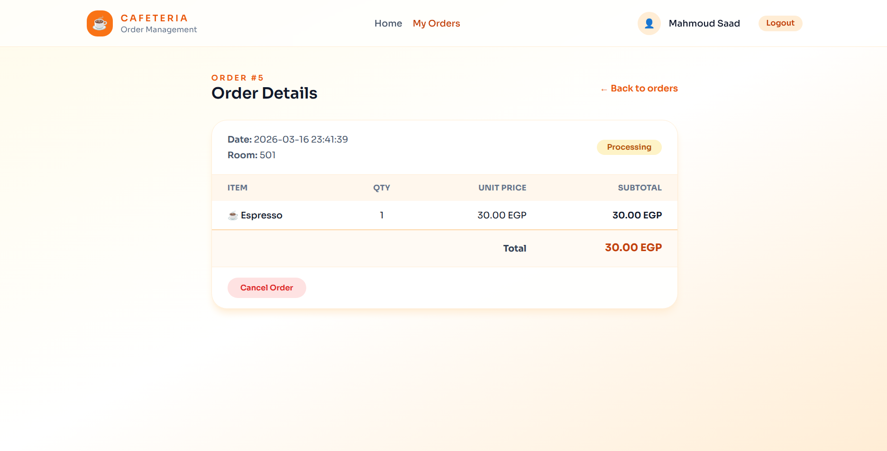
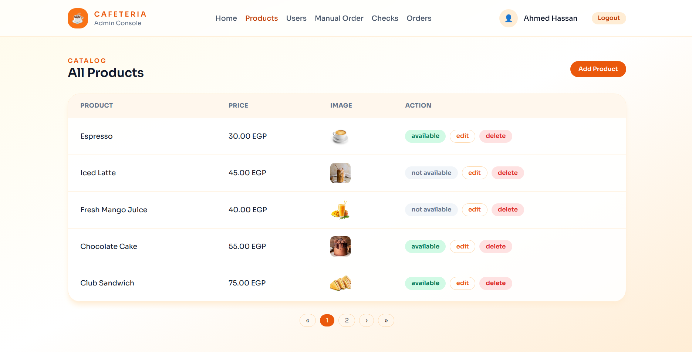
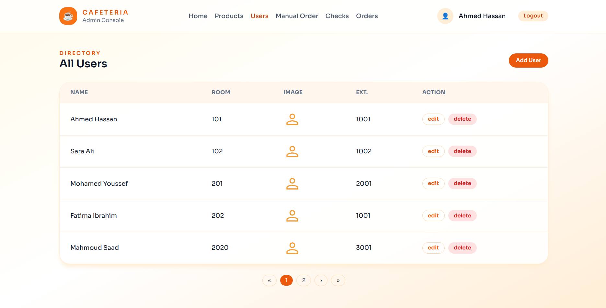
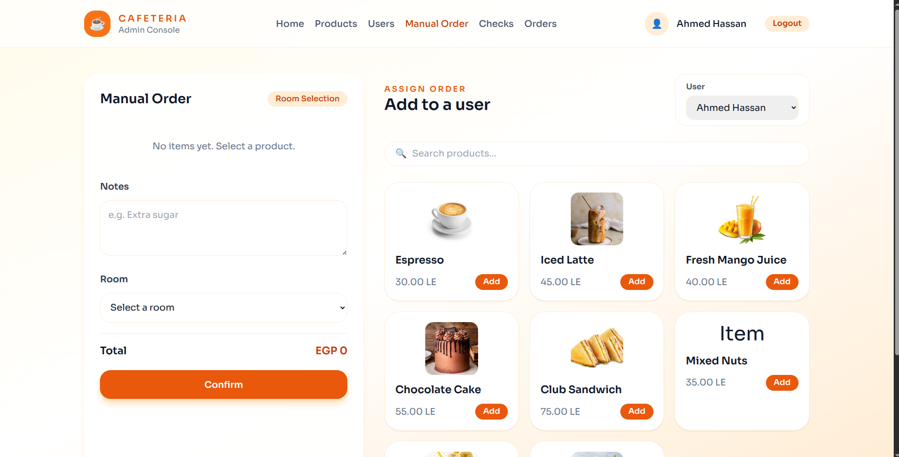
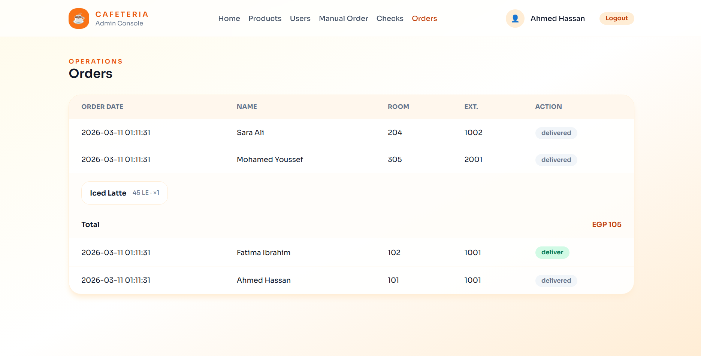
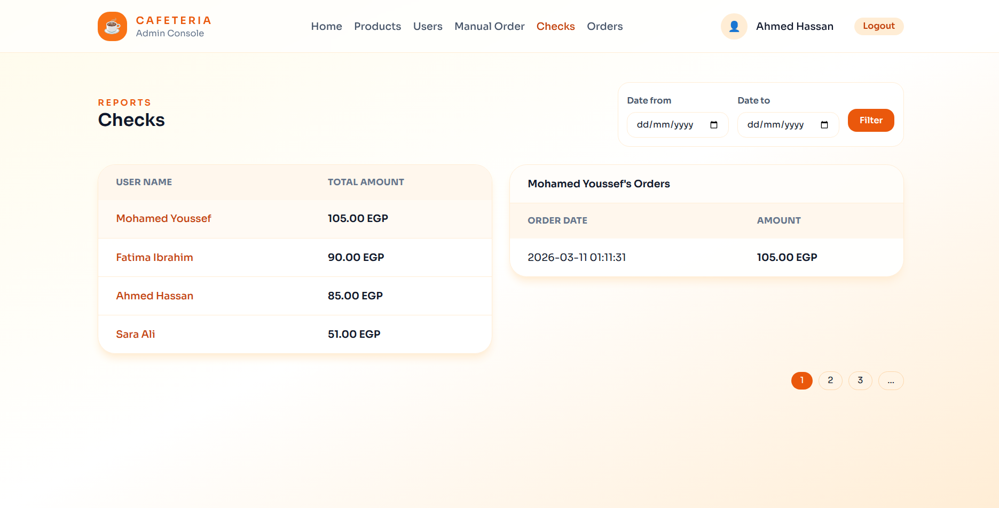

# Cafeteria Management System

## Overview

This project is a PHP-based cafeteria management system that supports user ordering, order tracking, administration, and reporting workflows.

It includes:

- Authentication and session-based access control
- User product ordering and cart management
- Order confirmation and storage
- Order history and cancellation
- Admin management for products and users
- Reports, checks, and order delivery workflows

## Team Members and Responsibilities

| Member | Responsibility |
| --- | --- |
| Mostafa Abdelmajied | Authentication, application structure, and overall layout. This included checking the user, saving sessions, and protecting pages through middlewares. |
| Samer Yousry | User ordering system. This included showing products, adding products to cart, modifying quantity, calculating price, and saving the order. |
| Ali Essam | My Orders and user history. This included showing order history, filtering by date, showing order details, and canceling orders. |
| Mohamed Waleed | Admin management. This included CRUD operations for products and users, in addition to image uploading. |
| Abd Alhameed | Reports and order delivery. This included creating orders for users, showing new orders, delivering orders, generating reports by user, and total calculations. |

## Main Features

- Secure authentication and protected routes
- Product browsing and cart-based ordering
- Quantity updates and dynamic total calculation
- Order confirmation and persistence
- User order history with date filtering
- Order details and cancellation
- Product and user management for admins
- Image upload support for products
- Manual order creation and delivery workflow
- Reporting and total summaries

## Quick Start

These are the steps needed to run the project for the first time.

1. Place the project inside the XAMPP web root, for example: `C:\xampp\htdocs\cafeteria`
2. Start `Apache` and `MySQL` from XAMPP Control Panel
3. Create a database named `cafeteria_db`
4. Import the provided SQL dump from [backup.sql](c:/xampp/htdocs/cafeteria/backup.sql)
5. Make sure the environment file contains the correct database settings:

```env
DB_HOST=localhost
DB_NAME=cafeteria_db
DB_USER=root
DB_PASS=
```

6. Open the project in the browser:
   `http://localhost/cafeteria`

## Database / Seeder Notes

- There is no separate Laravel-style seeder or migration command in this project.
- The initial database data is provided through [backup.sql](c:/xampp/htdocs/cafeteria/backup.sql).
- Importing `backup.sql` is the required first-time setup step.

## Commands

This project is a plain PHP application and does not require a build step.

If dependencies are missing in a clean clone, run:

```bash
composer install
```

In this repository, the `vendor` folder is already present, so `composer install` may not be necessary unless dependencies were removed.

## Demo Login Credentials

The SQL dump includes seeded users in the `users` table.

Suggested accounts for demonstration:

| Role | Email | Password |
| --- | --- | --- |
| Admin | `ahmed.hassan@example.com` | `12345678` |
| Admin | `omar.khaled@example.com` | `12345678` |
| User | `sara.ali@example.com` | `12345678` |
| User | `m.youssef@example.com` | `12345678` |

## Authentication Note

- The login flow now verifies the entered password against the stored hashed password using `password_verify(...)`.
- The seeded users imported from [backup.sql](c:/xampp/htdocs/cafeteria/backup.sql) use the password `12345678`.
- New and updated user passwords are stored as hashed values in the database.

## Screenshots

| View | Screenshot |
| --- | --- |
| Login |  |
| Home / Products | |
| Order Confirmation |  |
| My Orders |  |
| Order Details|  |
| Admin Products |  |
| Admin Users |  |
| Admin Manual Order |  |
| Admin Orders / Delivery |  |
| Reports / Checks |  |
